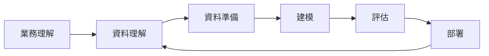

# 📘 第 2 週：資料探勘流程與資料型態

本週課程目標：

1. 理解業界最常用的資料探勘流程 **CRISP-DM**。
2. 認識不同的資料型態，包括 **結構化資料** 與 **非結構化資料**。
3. 區分 **標籤資料 (Labeled Data)** 與 **非標籤資料 (Unlabeled Data)**，並理解它們在機器學習與資料探勘中的角色。

---

## 2.1 CRISP-DM 流程 (業界標準流程)

CRISP-DM (Cross Industry Standard Process for Data Mining) 是目前業界最常用的資料探勘標準流程，涵蓋了專案從需求分析到模型部署的完整循環。

### 2.1.1 六個主要階段

1. **業務理解 (Business Understanding)**
   - 確定專案目標與商業價值
   - 例：零售業希望提升顧客留存率，需建立流失預測模型
2. **資料理解 (Data Understanding)**
   - 收集資料、檢視資料品質、探索資料分布
   - 例：分析顧客年齡分布、購買頻率、消費習慣
3. **資料準備 (Data Preparation)**
   - 包括資料清理 (Missing Values 處理)、整合 (Integration)、轉換 (Transformation)、特徵選擇 (Feature Selection)
4. **建模 (Modeling)**
   - 選擇適合的演算法（分類、回歸、分群等）
   - 設定參數與交叉驗證 (Cross-validation)
5. **評估 (Evaluation)**
   - 檢驗模型是否符合業務需求
   - 指標：準確率、召回率、F1-score、ROC、PR 曲線
6. **部署 (Deployment)**
   - 將模型應用於實際場景，產生商業價值
   - 例：建立即時預測系統、提供決策建議

---

### 2.1.2 CRISP-DM 特點

- **循環性 (Iterative)**：可隨時返回前一階段修正
- **跨領域性 (Cross-industry)**：適用於金融、醫療、行銷、製造等產業
- **結構清晰 (Structured)**：提供專案管理的清晰框架

---

### 2.1.3 視覺化流程圖

